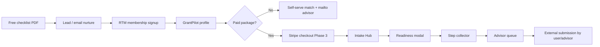
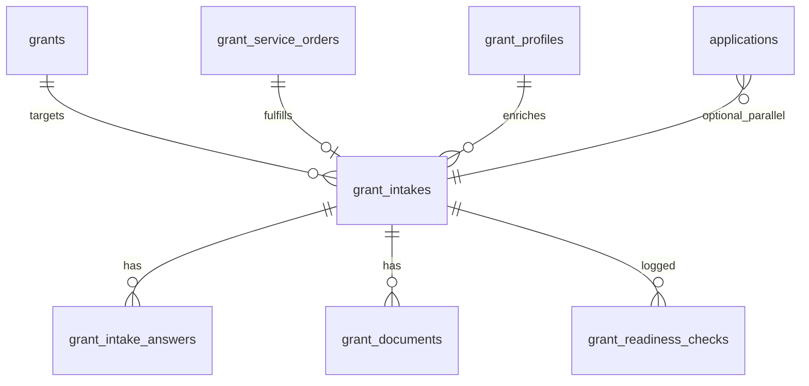

# RTM Grant Intake Hub — Product & Engineering Plan

**Status:** Phase 2 — Application Assistant (OpenRouter) + GrantPilot intake UI + admin intakes queue  
**AI roadmap:** [docs/RTM_AI_INTEGRATION_ROADMAP.md](./docs/RTM_AI_INTEGRATION_ROADMAP.md)
**Database:** `kajwpmyloxaqeciyndwf` (single Supabase for directory, membership, grants)  
**Canonical checklist PDF:** [`/downloads/RTM_Grant_Checklist.pdf`](./public/downloads/RTM_Grant_Checklist.pdf)

> **PDF consolidation:** The repo root copy `RTM_Grant_Checklist.pdf` is a duplicate of the canonical file under `public/downloads/`. Use only the public path in emails, CTAs, and auto-replies. Do not add new references to the root copy.

---

## Executive summary

RTM’s grant processing funnel today spans three apps on one database: free checklist leads on the directory site, membership signup/payment on `membership.rtmbusinessdirectory.com`, and GrantPilot on `grants.rtmbusinessdirectory.com`. **Option 1 — AI Intake Hub** unifies paid package fulfillment into a structured intake workflow: compare grant requirements against the member’s profile, uploaded documents, and guided answers; produce a **readiness score**; collect missing information step-by-step; and (Phase 2+) draft narrative sections for advisor review — **never auto-submit** to government portals.

Phase 1 delivered the **data model** and **rules-first readiness engine**. Phase 2 adds **OpenRouter-backed** `generate_draft` in `grant-intake-assistant`, Storage uploads, GrantPilot intake UI, and admin **Intakes** tab. Stripe checkout wiring remains Phase 3.

| Repo | Role in intake hub |
|------|-------------------|
| `launchpad-canada-ai` | Schema migrations, edge functions, admin queue extensions, `/grants` marketing |
| `stellar-business-os` | GrantPilot workspace UI — intake wizard, readiness modal, document upload |
| `rtm-community-network` | Post-payment routing to grants workspace with package context |

---

## Option 1 — AI Intake Hub (primary)

### What it does

1. Member selects a **target grant** (from catalog or advisor recommendation).
2. System loads **grant requirements** (`required_fields`, `required_documents` on `grants`) plus user **grant_profile** and any prior **intake answers**.
3. **Rules engine** scores readiness and lists gaps (no LLM in Phase 1).
4. Guided **step collector** walks missing fields and document uploads.
5. When score meets **package threshold**, intake moves to **advisor queue** (`admin-grants-bff` + new intake tab).
6. Phase 2+: **Application Assistant** (customer-facing name; internal action `generate_draft`) produces editable narrative drafts; advisor approves before external submission.

Customer-facing copy: **“Application Assistant”** / **“Prepare with RTM”**. Avoid “AI submits your grant” language.

### User journeys



#### Journey 1 — Free checklist → member

| Step | Touchpoint | System |
|------|------------|--------|
| 1 | `/grants` → Request checklist | `grant-checklist-lead` → `grant_checklist_leads` |
| 2 | Email with PDF link | `https://www.rtmbusinessdirectory.com/downloads/RTM_Grant_Checklist.pdf` |
| 3 | Membership CTA | `membership.rtmbusinessdirectory.com/signup` |
| 4 | Active member | `profiles.membership_status = 'active'` |

No intake record yet — lead stays in checklist CRM until conversion.

#### Journey 2 — Member → Funding Workspace

| Step | Touchpoint | System |
|------|------------|--------|
| 1 | Open grant workspace | Token handoff or sign-in on `grants.rtmbusinessdirectory.com` |
| 2 | Build grant profile | `grant_profiles.profile` jsonb |
| 3 | Browse / match grants | `fetchRecommendedGrants()` + catalog |
| 4 | Start intake (Phase 2 UI) | `grant_intakes` row, status `draft` |

#### Journey 3 — Paid package → Intake Hub

| Step | Touchpoint | System |
|------|------------|--------|
| 1 | Choose package on `/grants` or GrantPilot | `GRANT_PACKAGES` in `src/lib/grantPackages.ts` |
| 2 | Checkout (Phase 3) | Stripe → `grant_service_orders` |
| 3 | Post-payment redirect | Membership → grants URL with `?package=<id>` |
| 4 | Intake created / linked | `grant_intakes.package_id`, `grant_service_orders.intake_id` |
| 5 | Readiness + collection | Rules engine + step UI |
| 6 | Advisor handoff | Admin intake queue when threshold met |

#### Journey 4 — Advisor queue → submission

| Step | Actor | System |
|------|-------|--------|
| 1 | Review intake | Admin `/admin/grants` (extend beyond applications list) |
| 2 | Request fixes | Status `collecting`, notes on intake |
| 3 | Approve drafts | Phase 2 `generate_draft` output stored in answers |
| 4 | Submit externally | User/advisor on official portal; intake → `submitted_externally` |

---

## Options 2 & 3 — Fallbacks

These remain available if Intake Hub is deferred, overloaded, or unsuitable for a client.

### Option 2 — Advisor-led manual intake (no AI automation)

**When:** High-touch clients, complex multi-grant strategies, or Phase 1 before UI ships.

| Aspect | Behavior |
|--------|----------|
| Purchase | Mailto / manual invoice → admin creates `grant_service_orders` |
| Data collection | Email + shared folder; optional `applications` row with notes |
| Readiness | Advisor judgment; optional manual `grant_readiness_checks` |
| Narratives | Human-written only |
| Queue | Existing `admin-grants-bff` applications list |

Intake Hub tables still useful as structured storage; AI actions stay disabled.

### Option 3 — Self-serve only (checklist + profile matching)

**When:** Free tier, early members, or prospects not ready for paid packages.

| Aspect | Behavior |
|--------|----------|
| Checklist | PDF + lead capture only |
| Matching | `scoreGrantForProfile()` — no per-grant intake |
| Packages | Mailto CTAs from `getPackageRequestMailto()` |
| Admin | Checklist leads tab only |

No `grant_intakes` unless user upgrades to Option 1 or 2.

---

## Data model

Migration: `supabase/migrations/20260524120000_grant_intake_hub.sql`

### Extended `grants`

| Column | Type | Purpose |
|--------|------|---------|
| `required_fields` | `jsonb` | Array of field key objects `{ "key", "label", "required", "weight" }` |
| `required_documents` | `jsonb` | Array of doc type objects `{ "key", "label", "required", "weight" }` |

Seeded with a **generic Canadian SME set** for all active grants (customize per grant later).

### `grant_intakes`

One row per user × grant pursuit (optionally scoped to a package order).

| Column | Type | Notes |
|--------|------|-------|
| `id` | `uuid` PK | |
| `user_id` | `uuid` | `auth.users.id` |
| `grant_id` | `text` FK → `grants.id` | |
| `package_id` | `text` | `maple-checklist`, etc.; nullable for self-serve |
| `service_order_id` | `uuid` FK → `grant_service_orders.id` | nullable |
| `status` | `text` | `draft`, `collecting`, `ready_for_review`, `with_advisor`, `submitted_externally`, `closed` |
| `readiness_score` | `int` | 0–100, cached from latest check |
| `readiness_status` | `text` | `not_ready`, `partially_ready`, `mostly_ready`, `ready` |
| `advisor_notes` | `text` | Admin only |
| `source` | `text` | `grants_workspace`, `package_checkout`, `admin` |
| `created_at`, `updated_at` | `timestamptz` | |

Unique partial index: one open intake per `(user_id, grant_id)` where status not in (`closed`, `submitted_externally`).

### `grant_intake_answers`

| Column | Type | Notes |
|--------|------|-------|
| `id` | `uuid` PK | |
| `intake_id` | `uuid` FK | |
| `field_key` | `text` | Matches `GrantIntakeFieldKey` enum |
| `value` | `jsonb` | string, number, or structured object |
| `source` | `text` | `profile`, `user_input`, `ai_suggested`, `advisor` |
| `created_at`, `updated_at` | `timestamptz` | |

Unique `(intake_id, field_key)`.

### `grant_documents`

| Column | Type | Notes |
|--------|------|-------|
| `id` | `uuid` PK | |
| `intake_id` | `uuid` FK | |
| `user_id` | `uuid` | Denormalized for RLS |
| `document_type` | `text` | Matches `GrantDocumentType` enum |
| `storage_path` | `text` | Supabase Storage path (Phase 2) |
| `file_name` | `text` | |
| `mime_type` | `text` | |
| `status` | `text` | `missing`, `uploaded`, `verified`, `rejected` |
| `uploaded_at` | `timestamptz` | |

### `grant_readiness_checks`

Audit trail of scoring runs.

| Column | Type | Notes |
|--------|------|-------|
| `id` | `uuid` PK | |
| `intake_id` | `uuid` FK | |
| `check_type` | `text` | `rules`, `ai` (Phase 2+) |
| `score` | `int` | 0–100 |
| `status` | `text` | Same enum as intake readiness_status |
| `details` | `jsonb` | `{ missingFields, missingDocuments, profileGaps, blockers }` |
| `created_at` | `timestamptz` | |

### `grant_service_orders`

Links Stripe (Phase 3) to intake.

| Column | Type | Notes |
|--------|------|-------|
| `id` | `uuid` PK | |
| `user_id` | `uuid` | |
| `package_id` | `text` | Required |
| `intake_id` | `uuid` FK | Set after intake created |
| `stripe_checkout_session_id` | `text` | |
| `stripe_payment_intent_id` | `text` | |
| `amount_cents` | `int` | CAD cents |
| `currency` | `text` | default `cad` |
| `status` | `text` | `pending`, `paid`, `fulfilled`, `refunded`, `cancelled` |
| `created_at`, `updated_at` | `timestamptz` | |

### Relationships



`applications` remains the legacy/simple submission record; intakes can link via `applications.data->>'intake_id'` in Phase 2.

---

## Readiness algorithm (rules-first, then AI)

Implemented in `src/lib/grantIntake.ts` (client) and `grant-intake-assistant` edge function (server). **Phase 1: rules only.**

### Inputs

1. Grant `required_fields` / `required_documents` (with weights).
2. `grant_profiles.profile` mapped to field keys.
3. `grant_intake_answers` for intake-specific fields.
4. `grant_documents` with status `uploaded` or `verified`.

### Scoring formula

```
profilePct   = weightedProfileFieldsPresent / weightedProfileFieldsRequired
answersPct   = weightedAnswersPresent / weightedAnswersRequired
documentsPct = weightedDocsPresent / weightedDocsRequired

readiness_score = round(
  profilePct   * 30 +
  answersPct   * 40 +
  documentsPct * 30
)   // each term is 0–100 scale before weighting → result 0–100
```

Default weights per field/document: `1`. Required items count toward denominator; optional items add bonus up to +5 points (cap 100).

### Status thresholds

| Score | `readiness_status` | UX label |
|------:|--------------------|----------|
| 0–39 | `not_ready` | Not ready — significant gaps |
| 40–69 | `partially_ready` | Partially ready — keep collecting |
| 70–89 | `mostly_ready` | Mostly ready — advisor prep |
| 90–100 | `ready` | Ready for advisor review |

### Package gates

Minimum scores before advisor queue auto-enqueue (see `src/lib/grantPackages.ts`):

| Package | Min readiness | Min profile completion |
|---------|--------------:|------------------------:|
| Maple Checklist | 30 | 40 |
| True North Standard | 60 | 60 |
| Provincial Bridge | 75 | 70 |
| Northern Star | 85 | 80 |

### Phase 2 AI layer

After rules pass, optional `check_type = 'ai'` run:

- Compare free-text answers to grant `eligibility_summary` and `requirements`.
- Flag contradictions as `blockers` in `details`.
- Adjust score ±10 with human-readable rationale (never below rules-only score for compliance fields).

LLM prompts stay **server-side only** in the edge function; not exposed to the client.

---

## AI architecture

### Edge function: `grant-intake-assistant`

| Setting | Value |
|---------|-------|
| Project | kajwp (deploy from launchpad) |
| `verify_jwt` | `false` — JWT validated inside handler |
| CORS | `_shared/cors.ts` (grants + directory origins) |

### Actions

| Action | Phase | Description |
|--------|-------|-------------|
| `analyze_readiness` | 1 | Rules engine; persists `grant_readiness_checks`; updates intake score |
| `list_missing` | 1 | Returns missing field keys and document types |
| `generate_draft` | 2 | OpenRouter narrative drafts → `grant_intake_answers` (`source: ai_suggested`) |

### Request shape

```json
{
  "action": "analyze_readiness",
  "intake_id": "uuid",
  "grant_id": "csbfp"
}
```

Auth: `Authorization: Bearer <user JWT>`. User must own intake; admins may analyze any intake.

### Application Assistant — OpenRouter (Phase 2)

| Secret / env | Purpose |
|--------------|---------|
| `OPENROUTER_API_KEY` | Edge secret only (never commit) |
| `OPENROUTER_MODEL` | Edge secret; default `openai/gpt-oss-120b:free` in `_shared/openrouter.ts` |

**Validate before deploy:** `OPENROUTER_API_KEY=sk-or-… node scripts/test-openrouter-model.mjs`

Fallback candidates (script order): `meta-llama/llama-3.3-70b-instruct:free`, `google/gemini-2.0-flash-exp:free`, `qwen/qwen-2.5-72b-instruct:free`.

- Store drafts in `grant_intake_answers` with `source = 'ai_suggested'`.
- Customer-facing label: **Application Assistant** (no “AI” in user strings from edge).
- Rate limit: 12 `ai_suggested` upserts per intake per hour; `max_tokens` ~700 per draft.

---

## UI flows (stellar-business-os — future sprints)

### Flow A — Grant selection → readiness modal

1. User opens grant detail in GrantPilot.
2. CTA **“Prepare with RTM”** creates or resumes `grant_intakes`.
3. Modal shows score ring, status label, top 3 gaps.
4. Actions: **Start collecting**, **Upload documents**, **Talk to advisor** (mailto fallback).

### Flow B — Step collector

1. Ordered steps from `list_missing` grouped: Profile → Business → Project → Documents.
2. Auto-save answers to `grant_intake_answers`.
3. Re-run `analyze_readiness` on step completion.
4. Progress bar tied to package threshold.

### Flow C — Advisor queue (launchpad admin)

1. Extend `/admin/grants` with **Intakes** tab.
2. Filter by status, package, grant, readiness.
3. Open intake detail: answers, documents, check history, link to user email.
4. Status transitions: `with_advisor` → `submitted_externally` / `closed`.

### Flow D — Post-payment (membership)

After Stripe webhook creates `grant_service_orders`, redirect:

`https://grants.rtmbusinessdirectory.com/intake?package=true-north-standard`

GrantPilot creates intake and opens readiness modal.

---

## Package-specific requirements

Beyond generic SME fields, each package implies deliverables:

| Package | Intake focus | Document emphasis | Advisor SLA |
|---------|--------------|-------------------|-------------|
| **Maple Checklist** | Program shortlist + eligibility | Business registration, financial summary | 2 business days |
| **True North Standard** | Single primary grant deep prep | Full financials, business plan, project budget | 5 business days |
| **Provincial Bridge** | Multi-program provincial map | Provincial registrations, compliance attestations | 7 business days |
| **Northern Star** | End-to-end pursuit | All of the above + export/market docs if applicable | Dedicated advisor |

Package ID stored on intake drives which **required_fields** subset is enforced (via weight overrides in app layer).

---

## Phased rollout

| Phase | Scope | Exit criteria |
|-------|--------|---------------|
| **1** | Schema, RLS, rules lib, stub edge, seed grant requirements | Migration applied; `analyze_readiness` returns score in Postman |
| **2** | GrantPilot readiness modal + step collector + Storage uploads | User can complete intake to package threshold |
| **2b** | `generate_draft` LLM + editable narrative UI | Advisor sees AI draft with disclaimer |
| **3** | Stripe package checkout + `grant_service_orders` webhook | Paid order creates intake automatically |
| **4** | Admin intake workspace + advisor status workflow | Ops can run queue without SQL |

---

## Integration with existing systems

| Existing | Integration |
|----------|-------------|
| `grant_profiles` | Profile jsonb mapped to intake field keys on analyze |
| `grantPackages.ts` | Package thresholds + checkout metadata |
| `applications` | Parallel simple submissions; link intake_id in jsonb when both exist |
| `admin-grants-bff` | Extend with `list-intakes`, `get-intake` actions (Phase 4) |
| `grant-checklist-lead` | PDF URL must use `/downloads/RTM_Grant_Checklist.pdf` |
| `check-membership` / `provision-member-account` | Gate paid packages; post-payment routing |
| `fetchRecommendedGrants()` | Drives grant selection before intake create |

---

## Test plan

### Phase 1 — Schema & rules

- [ ] Apply migration on kajwp; verify tables + RLS with test user JWT.
- [ ] Confirm `grants.required_documents` seeded for all active grants.
- [ ] Insert intake as user A; user B cannot select/update (403 via RLS).
- [ ] Admin can read all intakes via `is_admin()`.
- [ ] `analyze_readiness` with empty profile → score &lt; 40, status `not_ready`.
- [ ] Populate profile + answers + docs → score crosses 90, status `ready`.
- [ ] `list_missing` returns correct keys vs grant requirements.
- [ ] `generate_draft` returns draft text; saved with `ai_suggested` after user confirms in UI.
- [ ] Run `scripts/test-openrouter-model.mjs` and set `OPENROUTER_MODEL` secret to validated model.

### Phase 2 — UI

- [ ] Create intake from grant detail; modal shows score.
- [ ] Step collector saves answers; score updates live.
- [ ] Document upload sets status `uploaded`; verified only via admin.

### Phase 3 — Payments

- [ ] Test Stripe checkout creates `grant_service_orders`.
- [ ] Webhook idempotency; duplicate events do not duplicate intakes.
- [ ] Member price vs list price based on `membership_status`.

### Phase 4 — Admin

- [ ] Intake queue sort/filter; status transitions audit in `updated_at`.
- [ ] Advisor notes not visible to member via RLS.

### Regression

- [ ] Free checklist flow still works; PDF link canonical path only.
- [ ] Grant catalog public read unchanged.
- [ ] Cross-subdomain auth handoff still works.

---

## Security & RLS

| Table | Member | Admin | Service role |
|-------|--------|-------|--------------|
| `grant_intakes` | CRUD own rows | CRUD all | Full |
| `grant_intake_answers` | CRUD via own intake | CRUD all | Full |
| `grant_documents` | CRUD own | Read/update status | Full |
| `grant_readiness_checks` | Read own | Read all | Insert via edge |
| `grant_service_orders` | Read own | Read/update all | Full |

Principles:

- Never expose service role to client.
- Edge function validates JWT then uses service role for writes that span joins.
- Storage bucket policies (Phase 2): path `{user_id}/{intake_id}/{document_type}`.
- AI prompts and API keys server-only.
- PII in answers/documents — same retention policy as `applications`.

---

## Related docs

- [PLATFORM.md](./PLATFORM.md) — apps, domains, kajwp consolidation
- [GRANT_PACKAGES.md](./GRANT_PACKAGES.md) — Stripe product setup
- [GRANT_CHECKLIST_LEADS.md](./GRANT_CHECKLIST_LEADS.md) — free funnel
- Migration: `supabase/migrations/20260524120000_grant_intake_hub.sql`
- Library: `src/lib/grantIntake.ts`
