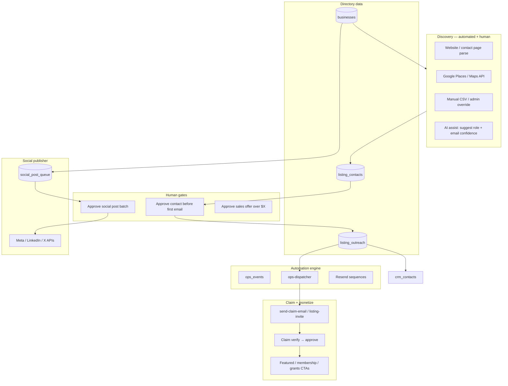

# Directory Listing Outreach & Marketing Automation — Master Plan

**Status:** Implemented in repo — deploy secrets per [RTM_SECRETS_PLACEHOLDER.env](./RTM_SECRETS_PLACEHOLDER.env)  
**Last updated:** 2026-05-25  
**Database:** `kajwpmyloxaqeciyndwf`  
**North star:** Find the right owner contact for each directory listing, invite them to **claim** their profile, then run **email + sales + marketing + social** automations — with **human approval** before bulk outreach and before any paid social spend.

**Related:**

| Doc | Role |
|-----|------|
| [RTM_OPERATIONS_AUTOMATION_MASTER_PLAN.md](./RTM_OPERATIONS_AUTOMATION_MASTER_PLAN.md) | Unified CRM, `ops_events`, nurture, HITL classes |
| [GRANT_PLATFORM_ROADMAP.md](../GRANT_PLATFORM_ROADMAP.md) | Grant trust + revenue (parallel track) |
| [PLATFORM.md](../PLATFORM.md) | Domains, Supabase, edge functions |

---

## 1. What you asked for vs what exists today

### Requested capabilities

| Capability | Description |
|------------|-------------|
| **Owner discovery** | Identify who owns/operates each listed business |
| **Contact search** | Find correct email (and optional phone/social) |
| **Claim outreach** | Email owners to claim their listing on RTM |
| **Email automation** | Sequences, reminders, onboarding after claim |
| **Sales automation** | Upsell featured listing, membership, grants, World Cup |
| **Marketing automation** | Campaigns, segments, re-engagement |
| **Social posting** | Publish listing/product content to major networks |

### What already exists (build on this — do not restart)

| Piece | Status | Location |
|-------|--------|----------|
| `businesses` table | ✅ | `phone`, `website`, name, city, `is_verified` — **no owner email column yet** |
| `business_claims` | ✅ | User-initiated claim + `verification_token` |
| `send-claim-email` | ✅ | Verification / approved / rejected — **inbound claim only** |
| `claimBusiness()` | ✅ | `src/services/businesses.ts` — inserts claim; **does not invoke email edge fn** |
| Email templates | ✅ | `src/lib/email-templates.ts` — claim verification copy |
| Profile “Claim Now” | ⚠️ UI only | `ProfileSidebar.tsx` — toast mock, **not wired** to `claimBusiness` |
| CRM / ops events (planned) | 📋 | [RTM_OPERATIONS_AUTOMATION_MASTER_PLAN.md](./RTM_OPERATIONS_AUTOMATION_MASTER_PLAN.md) §5 |
| Resend | ✅ | Transactional email infra |

**Gap:** There is **no proactive outreach pipeline** (discover → enrich → approve → send → nurture → social). Claims only work if the owner already visits and submits.

---

## 2. Target architecture



**Principle (same as ops master plan):** Automation **prepares**; humans **approve** high-risk actions (first contact to a new email, bulk send, social posts, pricing).

---

## 3. Compliance first (Canada + email + social)

### 3.1 CASL (Canada’s Anti-Spam Legislation)

Outbound “claim your listing” email is a **commercial electronic message (CEM)** unless an exemption applies.

| Approach | Requirement |
|----------|-------------|
| **Conspicuous publication** | Email address published on the business’s own site for contact; message must be relevant to their business |
| **Existing relationship** | They already opted in or are a customer |
| **Express consent** | Checkbox on a form |

**System rules:**

- Store `contact_source` + `casl_basis` on every `listing_contacts` row (`website_public`, `places_api`, `manual_verified`, `opt_in`).
- **Block auto-send** if `casl_basis` is unknown or `confidence < threshold`.
- Every CEM includes: RTM identity, address, phone, **unsubscribe** / “not my business” link, one-click opt-out table `listing_suppressions`.
- **No purchased email lists.** No scraping personal Gmail/Yahoo from unrelated pages.

### 3.2 Privacy (PIPEDA)

- Document purpose: directory accuracy, claim invitation, marketing with consent.
- Retention: delete enrichment artifacts after 90 days if no engagement.
- “Not my business” → suppress + remove contact from outreach queue.

### 3.3 Social platforms

- Each network requires **OAuth business account** (Meta Business, LinkedIn Page, X API paid tier).
- Auto-post only **after** claim approval or explicit marketing opt-in from owner.
- RTM-owned channels may promote **public directory URLs**; owner-branded posts need owner authorization (Phase 4).

---

## 4. Data model (new tables on kajwp)

Migration name (proposed): `20260525100000_listing_outreach_automation.sql`

### 4.1 Extend `businesses`

```sql
alter table public.businesses add column if not exists owner_email text;
alter table public.businesses add column if not exists owner_name text;
alter table public.businesses add column if not exists claim_status text not null default 'unclaimed';
  -- unclaimed | invited | claimed | disputed | suppressed
alter table public.businesses add column if not exists claimed_by_user_id uuid references auth.users(id);
alter table public.businesses add column if not exists last_outreach_at timestamptz;
alter table public.businesses add column if not exists social_share_enabled boolean not null default false;
```

### 4.2 `listing_contacts` (enrichment candidates)

| Column | Purpose |
|--------|---------|
| `id` | uuid PK |
| `business_id` | FK → `businesses.business_id` |
| `email`, `phone`, `name`, `role` | Owner / manager / generic inbox |
| `source` | `website`, `google_places`, `manual`, `ai_inferred` |
| `source_url` | Evidence URL |
| `confidence` | 0–100 |
| `casl_basis` | enum text |
| `verified_at`, `verified_by` | Human confirmed |
| `is_primary` | One primary per business |

### 4.3 `listing_outreach` (campaign rows)

| Column | Purpose |
|--------|---------|
| `business_id`, `contact_id` | Who we’re contacting |
| `sequence_id` | e.g. `claim_invite_v1` |
| `step` | 0 = invite, 1 = reminder, 2 = value add |
| `status` | `queued`, `approved`, `sent`, `bounced`, `replied`, `opted_out`, `claimed` |
| `scheduled_at`, `sent_at` | Scheduling |
| `resend_message_id` | Audit |
| `approved_by` | Admin user id (HITL) |

### 4.4 `listing_suppressions`

Email or domain opt-out — never email again.

### 4.5 `social_post_queue`

| Column | Purpose |
|--------|---------|
| `business_id` | Optional — listing post |
| `product_type` | `listing`, `deal`, `grant_program`, `worldcup` |
| `payload` | jsonb: title, body, image_urls, link, hashtags |
| `channels` | `facebook`, `instagram`, `linkedin`, `x`, `google_business` |
| `status` | `draft`, `approved`, `scheduled`, `published`, `failed` |
| `published_urls` | jsonb per channel |
| `scheduled_at` | |

### 4.6 Link to unified CRM

On `listing_outreach.sent` or claim completed → upsert `crm_contacts` (from ops master plan) with `source = listing_outreach`, tags `directory_owner`.

---

## 5. Contact discovery pipeline

### 5.1 Priority order (per business)

1. **Existing fields** — `businesses.phone`, `businesses.website` (already in DB).
2. **Website crawl** — Edge function `listing-contact-enricher`:
   - Fetch `website` (respect robots, timeout, rate limit).
   - Parse `mailto:`, contact page, footer, JSON-LD `Organization.email`.
   - Prefer role-based emails: `info@`, `contact@`, `hello@` on **business domain** (not free webmail unless only option).
3. **Google Places API** (optional secret `GOOGLE_PLACES_API_KEY`) — place details phone/website; **not** personal emails.
4. **Manual admin** — `/admin/listings` search → paste email → `casl_basis = manual_verified`.
5. **AI assist (HITL B)** — `ops-ai-assistant` action `suggest_listing_contact`: summarizes site text; **does not auto-send**.

### 5.2 Confidence scoring (rules-first)

| Signal | Points |
|--------|--------|
| Email domain matches business website domain | +40 |
| Found on /contact or footer | +25 |
| mailto on homepage | +20 |
| Generic role inbox (info@, contact@) | +10 |
| Free webmail (gmail, yahoo, hotmail) | −20 |
| Role name in email (john@) | +5 |

**Auto-queue outreach only if score ≥ 70 and `casl_basis` set.**

### 5.3 Batch jobs

| Job | Schedule | Action |
|-----|----------|--------|
| `enrich-unclaimed-listings` | Nightly | Businesses where `claim_status = unclaimed` and no primary contact |
| `build-outreach-queue` | After enrich | Insert `listing_outreach` status `queued` |
| `stale-invite-reminder` | Day 7, 14 | Step 1–2 if not claimed and not opted out |

---

## 6. Email automation

### 6.1 New / extended edge functions

| Function | Purpose |
|----------|---------|
| `listing-contact-enricher` | Discovery pipeline (service role) |
| `listing-outreach-send` | Sends approved rows via Resend; records `resend_message_id` |
| Extend `send-claim-email` | Add action `owner_invite` with claim deep link token |
| `ops-dispatcher` | Handles `listing_outreach.approved`, `listing.claimed` → nurture |

### 6.2 Claim invite sequence (Class A after human approves step 0)

| Step | Day | Subject theme | CTA |
|------|-----|---------------|-----|
| 0 | 0 | Your business is listed on RTM — claim free | `https://rtmbusinessdirectory.com/claim?business=:id&token=:token` |
| 1 | 7 | Reminder — update your hours, photos, deals | Same link |
| 2 | 14 | World Cup 2026 / grants / membership value | Claim + explore |

**Token model:** Signed JWT or single-use token in `listing_outreach` linked to `business_id` — owner does not need account to **start** claim; creates account on verify.

### 6.3 Post-claim onboarding (Class A)

| Email | Trigger |
|-------|---------|
| Claim approved | Existing `send-claim-email` action `approved` |
| Complete your profile | 24h after approve if profile &lt; 50% |
| Add photos / deals | Day 3 |
| Grants + membership intro | Day 7 (cross-sell, grant disclaimer footer) |

### 6.4 Wire broken UI paths

| File | Fix |
|------|-----|
| `ProfileSidebar.tsx` | `handleClaim` → auth check → `claimBusiness()` → invoke `send-claim-email` |
| New `/claim` page | Verify token, sign-up/login, complete `business_claims` |

---

## 7. Sales automation (listing owners)

Integrate with `crm_deals` (ops master plan):

| Deal type | Trigger | Automation |
|-----------|---------|------------|
| `featured_listing` | Claim approved + profile complete | Email + task for sales (HITL C) |
| `membership` | Owner clicks grants CTA | Handoff to membership funnel |
| `grant_package` | Owner profile matches grant sectors | Nurture with grant disclaimer |
| `worldcup_supplier` | `is_world_cup_ready` or category match | Targeted sequence |

| Stage | Auto | Human |
|-------|------|-------|
| Discovery | AI draft pitch email | Approve send (G2) |
| Proposal | Stripe link for featured placement | Custom pricing (D) |
| Won | Update `businesses.is_verified`, enable `social_share_enabled` | Confirm |

**Rule:** No auto-invoice or auto-charge without Stripe checkout click.

---

## 8. Marketing automation

### 8.1 Segments (on `crm_contacts` + listing fields)

| Segment | Criteria |
|---------|----------|
| Unclaimed + high traffic city | Toronto, Vancouver, etc. |
| Claimed incomplete profile | `completion_pct < 60` |
| Claimed active | Posted deal or updated in 30d |
| Opted into grants | Clicked grant CTA from listing dashboard |

### 8.2 Campaigns (via `ops_events`)

| Campaign | Channels |
|----------|----------|
| Monthly directory digest | Email to members (existing) |
| “Your listing got X views” | Email to claimed owners (Class A) |
| Seasonal (World Cup) | Email + social queue |

### 8.3 Landing alignment

Claim emails point to:

- Listing profile URL (public)
- Owner dashboard `/dashboard` after auth
- Optional `?upgrade=featured` for sales

---

## 9. Social media automation

### 9.1 What “post listing to all major social” means technically

| Channel | API approach | Prerequisite |
|---------|--------------|--------------|
| **Facebook + Instagram** | Meta Graph API | Meta Business app, Page, IG Business linked |
| **LinkedIn** | Marketing API / share UGC | Company Page OAuth |
| **X (Twitter)** | X API v2 (paid) | Developer account |
| **Google Business Profile** | Business Profile API | Location verification (often manual) |
| **Pinterest / TikTok** | Phase 5+ | Separate apps |

**Realistic Phase 3 deliverable:** RTM’s own Facebook Page + LinkedIn + X auto-post **new/featured listings** from `social_post_queue`.  
**Phase 4:** Per-owner connected accounts (OAuth) post to **their** pages after claim.

### 9.2 Content generation (HITL B)

Edge function `social-content-generator` (OpenRouter):

- Input: business name, category, city, one photo URL, profile link.
- Output: 3 variants (short FB, LinkedIn professional, X thread-lite).
- Admin approves in `/admin/listings` → `social_post_queue.status = approved`.

**Template example:**

> 🍁 Now on RTM Business Directory: **{name}** in {city} — {category}. See hours, deals, and contact info → {url} #SmallBusiness #Canada

### 9.3 Publisher function

`supabase/functions/social-publisher` — consumes approved queue rows, calls channel adapters, stores `published_urls`, retries failures.

**Secrets (Vercel / Supabase):**

- `META_APP_ID`, `META_APP_SECRET`, `META_PAGE_ACCESS_TOKEN`
- `LINKEDIN_CLIENT_ID`, `LINKEDIN_CLIENT_SECRET`
- `X_API_KEY`, `X_API_SECRET`, `X_ACCESS_TOKEN`

### 9.4 Product pages on social

For grants/World Cup/deals: `product_type` in queue → link to `/grants`, `/deals`, etc. — same publisher, different templates.

---

## 10. Admin workspace

### 10.1 `/admin/listings` (new — launchpad)

| Tab | Actions |
|-----|---------|
| **Unclaimed** | Filter, run enrich, view confidence |
| **Contacts** | Approve primary email, set CASL basis |
| **Outreach queue** | Bulk approve sends, pause sequence |
| **Claims** | Approve/reject `business_claims` (existing data) |
| **Social** | Preview posts, approve batch, view publish log |
| **Suppressions** | Opt-outs |

### 10.2 Daily ops rhythm (listing team)

1. Approve today’s outreach batch (max N/day to protect domain reputation — start **50/day**).
2. Review bounces → suppress.
3. Approve social posts for new featured listings.
4. Work claim replies and sales tasks in `/admin/ops` inbox.

---

## 11. Implementation phases

### Phase A — Foundation (Weeks 1–2)

| ID | Task | Done when |
|----|------|-----------|
| A1 | Migration: listing tables + `businesses` columns | Applied on kajwp |
| A2 | Fix `ProfileSidebar` + `/claim` flow + `send-claim-email` invoke | Owner can self-claim end-to-end |
| A3 | `listing-contact-enricher` v1 (website + existing phone/website only) | Contacts row with confidence |
| A4 | `/admin/listings` MVP: unclaimed list + manual contact | Ops can approve email |

### Phase B — Outbound claim invites (Weeks 3–4)

| ID | Task | Done when |
|----|------|-----------|
| B1 | `listing-outreach-send` + invite templates (CASL footer) | Test send to internal addresses |
| B2 | HITL approve UI for queue | No send without `approved_by` |
| B3 | Opt-out link + `listing_suppressions` | One click stops sequence |
| B4 | Sync to `crm_contacts` on send/claim | Timeline in `/admin/ops` |

**Prerequisite:** Resend domain authentication (SPF/DKIM/DMARC).

### Phase C — Nurture + sales (Weeks 5–7)

| ID | Task | Done when |
|----|------|-----------|
| C1 | Post-claim email sequence | 3 emails after approve |
| C2 | `crm_deals` for featured listing | Deal created on CTA click |
| C3 | Owner dashboard: views counter (even if estimated initially) | “Your listing got X views” email |
| C4 | Cross-sell grants/membership emails (disclaimer) | From owner segment only |

Align CRM tables with [RTM_OPERATIONS_AUTOMATION_MASTER_PLAN.md](./RTM_OPERATIONS_AUTOMATION_MASTER_PLAN.md) Phase 1–2.

### Phase D — Social publisher (Weeks 8–10)

| ID | Task | Done when |
|----|------|-----------|
| D1 | `social_post_queue` + admin preview | Draft posts for 5 listings |
| D2 | Meta + LinkedIn adapters (RTM-owned channels) | Published with public URL |
| D3 | X adapter (if API access) | Optional channel |
| D4 | AI content generator (HITL B) | Approve before publish |

### Phase E — Scale + owner-connected social (Weeks 11–14)

| ID | Task | Done when |
|----|------|-----------|
| E1 | Google Places enricher | Higher contact yield |
| E2 | Bulk enrich cron + rate limits | 500 listings/week enriched |
| E3 | Owner OAuth “connect Facebook Page” | Post to **their** page after claim |
| E4 | Analytics: claim rate, email conversion, social CTR | Weekly dashboard |

---

## 12. Priority matrix

| Task | Effort | Impact | Phase |
|------|--------|--------|-------|
| Fix claim UI + email invoke | Low | High | A |
| Listing schema + admin contacts | Medium | High | A |
| Contact enricher (website) | Medium | High | A–B |
| CASL-safe invite sequence | Medium | Max | B |
| CRM sync | Medium | High | B–C |
| Post-claim nurture | Low | High | C |
| Social queue + Meta/LinkedIn | High | High | D |
| Owner-connected social OAuth | High | Medium | E |
| Google Places API | Medium | Medium | E |

---

## 13. Integration with existing ops automation

Add to `ops_events` types:

| `event_type` | Actions |
|--------------|---------|
| `listing.contact_found` | Notify ops if low confidence |
| `listing_outreach.approved` | Send via `listing-outreach-send` |
| `listing.invite_sent` | CRM activity |
| `listing.claimed` | Stop sequence, start post-claim nurture |
| `listing.opted_out` | Suppress, CRM note |
| `social_post.approved` | `social-publisher` |

**Dependency order:**

1. Complete ops **Phase 1** (`crm_contacts`, `ops-dispatcher`) — or implement listing tables with direct sync triggers first, then merge.
2. Grant trust sprint (disclaimers) — **required** before grant cross-sell emails to listing owners.

---

## 14. Metrics (90-day targets)

| Metric | Target |
|--------|--------|
| Unclaimed listings with primary contact | 60% of active listings |
| Invite → claim conversion | 5–12% (industry benchmark for cold invite) |
| Email bounce rate | < 3% |
| Opt-out rate | < 1% per campaign |
| Claim → profile 80% complete | 40% of claims |
| Featured / membership conversion from owners | Baseline + track |
| Social posts published / week | 10–30 (RTM channels) |
| CASL complaints | 0 |

---

## 15. What not to build (scope traps)

- Scraping personal emails from unrelated sites or social DMs.
- Auto-DMing business owners on Instagram/Facebook without consent.
- Buying “business owner email lists.”
- Auto-posting as the **business** without OAuth consent.
- Fully unattended bulk send without daily human cap.

---

## 16. Recommended start order

1. **Phase A1–A2** — schema + working self-claim (fixes trust on existing UI).  
2. **Phase A3–A4** — enricher + admin approve contacts.  
3. **Ops Phase 1 CRM** — single contact record per email.  
4. **Phase B** — CASL-compliant invite sequence with human approve.  
5. **Phase D** — social queue for RTM-owned channels only.  

---

## 17. Deploy + secrets

**LO-001 through Phase D gaps** are implemented in the repo. To go live:

1. Fill **[RTM_SECRETS_PLACEHOLDER.env](./RTM_SECRETS_PLACEHOLDER.env)** (copy to `RTM_SECRETS.local.env`).
2. Follow **[LISTING_OUTREACH_DEPLOY.md](./LISTING_OUTREACH_DEPLOY.md)** — `db push`, deploy edge functions, daily cron.

**Still manual / Phase E:** Owner OAuth social (`social_oauth_connections` schema only), full `/admin/ops` Kanban, `ops-ai-assistant`.
