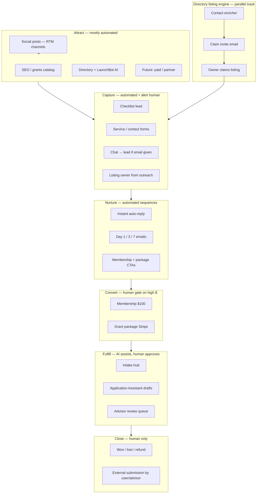

# RTM Operations Automation — Master Plan

**Status:** Active master document  
**Last updated:** 2026-05-25 (directory listing + social track integrated)  
**Owner:** RTM ops + engineering  
**North star:** Automate market → convert → fulfill → close, with **humans approving every revenue and submission decision**.

> This is the **single operations blueprint**. Product/engineering detail lives in linked docs; do not duplicate their task lists here — reference them by ID.

**Related (authoritative for sub-areas):**

| Doc | Scope |
|-----|--------|
| [GRANT_PLATFORM_ROADMAP.md](../GRANT_PLATFORM_ROADMAP.md) | Trust, funnel, deploy, 6-week product sprint |
| [GRANT_INTAKE_HUB_PLAN.md](../GRANT_INTAKE_HUB_PLAN.md) | Paid fulfillment, intake hub, advisor queue |
| [GRANT_CHECKLIST_LEADS.md](../GRANT_CHECKLIST_LEADS.md) | Checklist capture, Resend, admin tab |
| [docs/RTM_AI_INTEGRATION_ROADMAP.md](./RTM_AI_INTEGRATION_ROADMAP.md) | OpenRouter, directory bot, intake AI |
| [PLATFORM.md](../PLATFORM.md) | Domains, auth, edge functions |
| [GRANT_PACKAGES.md](../GRANT_PACKAGES.md) | Stripe packages, webhook |
| [docs/OPS_CHECKLIST_LEADS.md](./OPS_CHECKLIST_LEADS.md) | Immediate human backlog (4 leads) |
| [docs/DIRECTORY_LISTING_OUTREACH_AUTOMATION_PLAN.md](./DIRECTORY_LISTING_OUTREACH_AUTOMATION_PLAN.md) | Owner discovery, claim invites, email/sales/social automation |
| [docs/RTM_GROW_MY_BUSINESS_BRAINSTORM.md](./RTM_GROW_MY_BUSINESS_BRAINSTORM.md) | Pillar #3 product, services, government recognition (brainstorm) |

**Database:** `kajwpmyloxaqeciyndwf` — one Supabase for directory, membership, grants, admin.

---

## 1. Executive summary

RTM runs a **multi-app Canadian business platform** with **two growth engines**: (1) **grant advisory** and (2) **directory listings** (claim, featured placement, cross-sell). Today:

- **Marketing** works on `rtmbusinessdirectory.com` (catalog, checklist, LaunchBot).
- **Capture** is partially automated (`grant_checklist_leads`, `service_requests`, applications).
- **Directory listings** exist in `businesses` but **no proactive owner outreach** — only reactive `business_claims` + `send-claim-email` when someone self-claims; Profile “Claim Now” is not fully wired.
- **Conversion** still leaks to `mailto:` in places; membership + Stripe exist but handoffs are manual.
- **Fulfillment** (intake hub) is built in code but not fully wired post-payment.
- **CRM** is admin tabs + status columns — not a unified pipeline with AI assist.
- **Social posting** of listings/products to major networks — **not built** (planned queue + publisher).

**Target:** One **contact-centric pipeline** in Supabase, event-driven automations (email, alerts, nurture), AI for **drafting and triage only**, and explicit **human gates** before money moves, contracts implied, bulk listing outreach, or social publishes.

**Directory listing automation (full spec):** [DIRECTORY_LISTING_OUTREACH_AUTOMATION_PLAN.md](./DIRECTORY_LISTING_OUTREACH_AUTOMATION_PLAN.md) — owner discovery, contact search, claim-invite email sequences, sales/marketing nurture, social publisher (Meta, LinkedIn, X, Google Business).



---

## 1b. Directory listing automation (summary)

| You asked for | In plan? | Where | Built in code? |
|---------------|----------|-------|----------------|
| Find business owners on listings | ✅ | [DIRECTORY_LISTING_OUTREACH_AUTOMATION_PLAN.md](./DIRECTORY_LISTING_OUTREACH_AUTOMATION_PLAN.md) §5 | ❌ `listing-contact-enricher` proposed |
| Search correct contact (email/phone) | ✅ | Same §5.1–5.2 (website, Places API, manual, AI assist) | ❌ |
| Email owners to claim listing | ✅ | Same §6 (invite sequence + CASL) | ⚠️ `send-claim-email` only for self-initiated claims |
| Full email automation | ✅ | Ops §6 + Directory §6–8 (sequences, post-claim) | Partial (Resend + checklist) |
| Sales automation | ✅ | Ops §6.4 + Directory §7 (`crm_deals` featured/membership) | ❌ |
| Marketing automation | ✅ | Ops §6.3 + Directory §8 (segments, campaigns) | ❌ |
| Social posting to major platforms | ✅ | Directory §9 (FB/IG, LinkedIn, X, Google Business) | ❌ `social-publisher` proposed |

**Human gates for listings:** approve contact before first email (G7), approve social batch (G8) — see §2 below.

---

## 2. Operating model — human-in-the-loop (HITL)

Automation **prepares**; humans **decide**. Every automated action is classified:

| Class | Meaning | Examples |
|-------|---------|----------|
| **A — Full auto** | No human needed; logged for audit | Checklist PDF auto-reply, team Slack on new lead, welcome email after signup |
| **B — AI draft, human send** | AI generates; human approves or edits before external send | Follow-up email after lead replies, narrative grant sections |
| **C — Human trigger** | System queues work; human clicks to proceed | Mark lead `contacted`, approve intake for advisor, change deal stage |
| **D — Human only** | Never automate | Pricing exceptions, refunds, legal commitments, submitting to government, claiming eligibility |

### Mandatory human gates

| Gate | Trigger | Who | SLA |
|------|---------|-----|-----|
| **G1 — First human touch** | Checklist lead `new` > 4h or high-intent signal | Grant advisor | 2 business days |
| **G2 — Sales qualify** | Lead requests call, replies with budget, or B2B domain | Sales/advisor | 1 business day |
| **G3 — Payment exception** | Failed checkout, dispute, custom package | Ops | Same day |
| **G4 — Advisor takeover** | Intake readiness ≥ package threshold | Grant advisor | Per package SLA (2–7 days) |
| **G5 — Draft approval** | Any `generate_draft` output | Advisor | Before member sees as “ready to submit” |
| **G6 — Close won/lost** | Deal outcome, refund, churn | Ops | Within 24h of event |
| **G7 — Listing outreach approve** | New `listing_contacts` before first CEM | Ops / listing team | Daily batch cap (e.g. 50/day) |
| **G8 — Social publish approve** | `social_post_queue` row before API publish | Marketing / ops | Before scheduled time |

AI must **never**:

- Auto-send email that promises grant approval or government affiliation.
- Auto-charge or change Stripe subscriptions without user action.
- Auto-submit applications to `.gc.ca` or lender portals.
- Auto-move a deal to **Won** without human confirmation.
- Bulk-send claim invites without CASL basis + human approve (G7).
- Post to Facebook/LinkedIn/X as the **business** without owner OAuth consent.

---

## 3. System map (today → target)

### 3.1 Apps and roles

| Domain | Repo | Ops role |
|--------|------|----------|
| `rtmbusinessdirectory.com` | `launchpad-canada-ai` | Marketing, checklist, admin CRM UI, edge functions |
| `membership.rtmbusinessdirectory.com` | `rtm-community-network` | Signup, $100 membership, referrals |
| `grants.rtmbusinessdirectory.com` | `stellar-business-os` | GrantPilot, packages, intake UI |
| Admin `/admin/grants` | launchpad | Leads, applications, intakes queue |

### 3.2 What already exists (build on this)

| Capability | Status | Location |
|------------|--------|----------|
| Checklist lead table + auto-reply | ✅ | `grant_checklist_leads`, `grant-checklist-lead` |
| Admin leads / intakes / applications tabs | ✅ | `AdminGrants.tsx`, `admin-grants-bff` |
| Resend transactional email | ✅ | Edge functions (`RESEND_API_KEY`) |
| Membership provision email | ✅ | `provision-member-account` |
| Stripe package checkout + webhook | ⚠ Partial | `grant-package-checkout`, `stripe-webhook` |
| Directory AI (LaunchBot) | ✅ Deploy path | `directory-assistant` |
| Grant intake AI (drafts) | ⚠ Backend only UI gap | `grant-intake-assistant` |
| Service requests (World Cup / forms) | ✅ Schema | `service_requests` |
| Rate limits on AI | ✅ | `ai_rate_limits` migration |
| `send-claim-email` | ✅ | Verification / approved / rejected only |
| `business_claims` | ✅ | User-initiated; no outreach queue |

### 3.3 What we add (this plan)

| Layer | Deliverable |
|-------|-------------|
| **Unified CRM** | `crm_contacts`, `crm_deals`, `crm_activities`, `crm_tasks` on kajwp |
| **Event bus** | `ops_events` table + edge `ops-dispatcher` (webhooks, email, Slack) |
| **Nurture engine** | Scheduled sequences keyed by pipeline stage |
| **AI ops copilot** | Admin-side: summarize lead, suggest reply, score intent (HITL B) |
| **Single ops inbox UI** | `/admin/ops` — pipeline board + contact timeline |
| **Inbound email sync** | Optional Phase 3: Resend inbound or forwarding parser → activities |
| **Listing outreach** | `listing_contacts`, `listing_outreach`, enricher, invite send — [DIRECTORY_LISTING_OUTREACH_AUTOMATION_PLAN.md](./DIRECTORY_LISTING_OUTREACH_AUTOMATION_PLAN.md) |
| **Social publisher** | `social_post_queue` + Meta / LinkedIn / X adapters |

---

## 4. Customer lifecycle (7 stages)

One contact may be in one **primary stage**; secondary tags track product interest (grants, directory listing, World Cup).

| Stage | ID | Entry signal | Primary automation | Human gate |
|-------|-----|--------------|-------------------|------------|
| **Visitor** | `visitor` | Page view, anonymous chat | Bot answers, capture email CTA | — |
| **Lead** | `lead` | Checklist, form, chat email | Auto-reply + team alert + nurture Day 0 | G1 |
| **Qualified** | `qualified` | Replied, profile fields, member signup started | AI summary + task for advisor | G2 |
| **Member** | `member` | `profiles.membership_status = active` | Welcome series, grants workspace link | — |
| **Opportunity** | `opportunity` | Package checkout started or intake created | Abandoned cart email | G3 if payment fails |
| **Customer** | `customer` | Paid `grant_service_orders` | Create intake, readiness nudges | G4 |
| **Alumni** | `alumni` | Intake closed / deal won-lost | NPS, referral ask | G6 |

### Stage transitions (rules)

```
visitor → lead          : email captured (checklist, form, bot handoff)
lead → qualified        : human marks OR auto: replied + 3 nurture opens OR member signup
qualified → member      : Stripe membership active (webhook)
member → opportunity    : package checkout session OR intake draft created
opportunity → customer  : Stripe payment succeeded (webhook)
customer → alumni       : intake status closed OR deal won/lost
any → lead              : re-engagement form (merge by email, don’t duplicate)
```

**Identity rule:** `crm_contacts.email` (lowercase) is the merge key across checklist leads, `profiles`, Stripe customer email, and **listing owner** outreach.

**Listing-owner tag:** `directory_owner` on `crm_contacts` when created from `listing_outreach` or successful claim — enables shared nurture with grant/membership cross-sell (grant disclaimer required).

---

## 5. Unified CRM data model (Supabase)

Keep CRM **in kajwp** first — external HubSpot/Pipedrive optional in Phase 4 export only.

### 5.1 Core tables (new migration)

```sql
-- crm_contacts: one row per unique email
-- crm_deals: revenue opportunities (membership, package, advisory)
-- crm_activities: timeline (email_sent, note, stage_change, ai_summary)
-- crm_tasks: human work items (follow_up, call, review_intake)
-- ops_events: outbox for automations (processed by ops-dispatcher)
```

| Table | Purpose | Key fields |
|-------|---------|------------|
| `crm_contacts` | Person / business | `email`, `name`, `phone`, `company`, `stage`, `source`, `profile_id`, `lead_score`, `owner_user_id` |
| `crm_deals` | Sale | `contact_id`, `type` (membership \| package \| custom), `amount_cents`, `stage` (open \| won \| lost), `stripe_session_id`, `grant_service_order_id`, `package_id` |
| `crm_activities` | Audit trail | `contact_id`, `deal_id`, `kind`, `payload` jsonb, `created_by` (system \| user \| ai) |
| `crm_tasks` | Human queue | `contact_id`, `type`, `due_at`, `status`, `assigned_to`, `ai_suggested_body` |
| `ops_events` | Automation queue | `event_type`, `payload`, `status`, `retry_count` |

### 5.2 Link existing tables (no duplicate leads)

| Existing | Links to CRM |
|----------|----------------|
| `grant_checklist_leads` | On insert/update → upsert `crm_contacts`, activity `checklist_requested` |
| `profiles` | `crm_contacts.profile_id` |
| `grant_service_orders` | `crm_deals` row, stage → customer |
| `grant_intakes` | Activity + task “advisor review” when readiness threshold met |
| `applications` | Activity on submit |
| `service_requests` | Upsert contact, task for ops |
| `listing_contacts` / `listing_outreach` | Contact + deal `featured_listing`; see directory plan §4–7 |
| `businesses` | `claim_status`, `owner_email` after enrich/claim |

### 5.3 Pipeline stages for deals

| Deal stage | Automation |
|------------|------------|
| `discovery` | Nurture emails |
| `proposal` | Human sent package recommendation (AI draft optional) |
| `checkout_started` | Abandoned cart reminder @ 1h, 24h |
| `won` | Human confirms webhook + intake created |
| `lost` | Human or auto after 30d inactive; stop nurture |

---

## 6. Automation matrix by function

### 6.1 Email (Resend)

| Email | Trigger | Class | Template owner |
|-------|---------|-------|----------------|
| Checklist auto-reply | `grant-checklist-lead` | A | `grant-checklist-lead/index.ts` |
| Team new lead alert | Same function | A | Same |
| Nurture Day 0 / 1 / 3 / 7 | `ops-dispatcher` cron | A | `src/lib/email-templates.ts` (extend) |
| Membership welcome | `provision-member-account` | A | Existing |
| Payment receipt + intake link | `stripe-webhook` | A | New `grant-payment-confirmation` |
| Abandoned checkout | Stripe session expired | A | New |
| Advisor personal follow-up | Task due G1 | B | AI suggests → human sends from mail client or approved send |
| Intake “needs documents” | Readiness gap | A | Templated; no eligibility guarantees |

**DNS (human once):** SPF, DKIM, DMARC for `noreply@rtmbusinessdirectory.com` — see [OPS_CHECKLIST_LEADS.md](./OPS_CHECKLIST_LEADS.md).

### 6.2 Onboarding

| Step | Automated | Human |
|------|-----------|-------|
| Signup | Email confirm, profile row | — |
| Payment | Stripe → `provision-member-account` | G3 on failure |
| First login grants | Token handoff URL in email | — |
| Grant profile empty | Email + in-app nudge Day 2 | Advisor optional call for True North+ |
| First intake | Webhook creates intake row | G4 when score ≥ threshold |

### 6.3 Marketing (attract + capture)

| Channel | Automation | Measure |
|---------|------------|---------|
| `/grants` SEO | Sitemap, canonical, disclaimer | Organic sessions |
| Catalog + detail | 217 grants, official URLs | Time on site |
| LaunchBot / directory-assistant | Grounded answers, lead CTA | Messages → email capture rate |
| Checklist CTA | Dialog → edge function | Leads/week |
| Apply for me / service | Form → `service_requests` + CRM | Leads/week |
| **Listing claim outreach** | Enrich contact → approve → invite email → claim | See [DIRECTORY_LISTING_OUTREACH_AUTOMATION_PLAN.md](./DIRECTORY_LISTING_OUTREACH_AUTOMATION_PLAN.md) |

**Copy rule (automated compliance snippets):** Every grant email and bot system prompt includes private-advisory disclaimer — align with [GRANT_PLATFORM_ROADMAP.md](../GRANT_PLATFORM_ROADMAP.md) Week 1.

### 6.4 Convert (sales)

| Motion | System path | HITL |
|--------|-------------|------|
| Free → member | Checklist nurture → membership signup | — |
| Member → package | Marketing URL → grants packages → Stripe | G2 for phone/consult requests |
| High-touch | `mailto:` remains **secondary** CTA only | Human owns thread |
| Deal desk | `/admin/ops` deal board | G6 win/loss |

**Revenue fix (prerequisite):** Primary package CTAs must not use `mailto:` — [GRANT_PLATFORM_ROADMAP.md](../GRANT_PLATFORM_ROADMAP.md) §2.1.

### 6.5 Fulfill (delivery)

Align with [GRANT_INTAKE_HUB_PLAN.md](../GRANT_INTAKE_HUB_PLAN.md):

| Package | Auto after payment | Human |
|---------|-------------------|-------|
| Maple Checklist | Intake + shortlist AI assist | Advisor validates shortlist (G4) |
| True North+ | Step collector + draft AI | G5 on every draft |
| All | Document upload reminders | Admin verifies docs |

### 6.6 Close (revenue + outcome)

| Outcome | System | Human |
|---------|--------|-------|
| Payment captured | `crm_deals.won`, activity | Confirm in admin |
| Refund / dispute | Stripe webhook → task | G3 |
| Submitted externally | Intake status `submitted_externally` | Advisor marks (G6) |
| Lost / no response | 30-day rule → `lost`, stop nurture | Optional human rescue task |

---

## 7. AI in operations (roles, not autopilot)

All AI via **OpenRouter in edge functions only** — [RTM_AI_INTEGRATION_ROADMAP.md](./RTM_AI_INTEGRATION_ROADMAP.md).

| AI role | Surface | Input | Output | HITL |
|---------|---------|-------|--------|------|
| **Front desk** | `directory-assistant`, LaunchBot | User message + optional profile | Answer + suggested next step | Class A for chat; capture email → lead |
| **Lead triage** | New `ops-ai-assistant` | Contact + activities + lead row | Intent score, suggested stage, draft reply | B — advisor approves send |
| **Nurture personalization** | Batch job | Contact stage + grant profile | Variant paragraph in template | A only if template pre-approved by legal |
| **Intake readiness** | `grant-intake-assistant` | Intake + grant rules | Score, gaps | A for score; B for drafts |
| **Application Assistant** | GrantPilot UI | Intake answers | Narrative draft | G5 mandatory |
| **Ops digest** | Daily cron | Open tasks, stale leads | Slack/email summary | A |

**New edge function:** `ops-ai-assistant` — actions: `summarize_contact`, `suggest_reply`, `score_intent`. Rate-limited; no PII in logs.

---

## 8. Event-driven architecture

### 8.1 Event types (`ops_events`)

| `event_type` | Source | Actions |
|--------------|--------|---------|
| `checklist_lead.created` | `grant-checklist-lead` | CRM upsert, team email, nurture schedule |
| `membership.activated` | `stripe-webhook` / provision | CRM stage member, welcome |
| `checkout.session.completed` | Stripe | Deal won, create intake, payment email |
| `checkout.session.expired` | Stripe | Abandoned cart sequence |
| `intake.ready_for_advisor` | Intake rules | Task G4, Slack |
| `lead.stale` | Cron (24h `new`) | Escalation email to ops |
| `task.due` | Cron | Reminder to assigned advisor |
| `listing.contact_found` | `listing-contact-enricher` | Queue for admin approve |
| `listing_outreach.approved` | Admin batch approve | `listing-outreach-send` |
| `listing.claimed` | Claim approved | Stop invite sequence; post-claim nurture |
| `social_post.approved` | Admin | `social-publisher` → Meta/LinkedIn/X |

### 8.2 Dispatcher

**Function:** `supabase/functions/ops-dispatcher`

- Consumes `ops_events` where `status = pending`
- Idempotent handlers per `event_type`
- Retries with backoff; dead-letter after 5 failures
- **No JWT** for internal cron; protect with service role + secret header

### 8.3 Notifications

| Channel | Use |
|---------|-----|
| Resend | Customer + advisor transactional |
| Slack / Discord webhook | Real-time ops alerts (optional secret) |
| Admin UI badges | Task count on `/admin/ops` |

---

## 9. Ops workspace (admin UX)

### 9.1 `/admin/ops` (new — launchpad)

| View | Purpose |
|------|---------|
| **Pipeline** | Kanban: Lead → Qualified → Member → Opportunity → Customer |
| **Inbox** | Tasks due today (G1–G6) |
| **Contact 360** | Timeline: emails, checklist, payments, intakes, AI summaries |
| **Deals** | Amount, package, Stripe link |
| **AI panel** | Summarize + suggest reply (copy to clipboard or “queue send” after approve) |

Migrate data from existing tabs over time; **keep** `/admin/grants` for grant-specific tables until unified.

### 9.2 Daily human rhythm (15 min)

1. Clear **Inbox** tasks past due.
2. Triage new leads (`new` → `contacted` + personal line in reply).
3. Review **AI suggested replies** — edit, send, log activity.
4. Check Stripe failures and intake queue.
5. Mark deals won/lost for yesterday’s checkouts.

---

## 10. Implementation phases

### Phase 0 — Stabilize (Week 0–1) — *no new CRM tables*

| ID | Task | Owner | Done when |
|----|------|-------|-----------|
| P0-1 | Clear 4 checklist backlog | Human | [OPS_CHECKLIST_LEADS.md](./OPS_CHECKLIST_LEADS.md) all ≠ `new` |
| P0-2 | Resend DNS + prod test submit | Human | Auto-reply received |
| P0-3 | Verify `grant-checklist-lead` team alert | Eng | Notification < 5 min |
| P0-4 | Legal/disclaimer on `/grants` | Eng | [GRANT_PLATFORM_ROADMAP.md](../GRANT_PLATFORM_ROADMAP.md) Wk1 |
| P0-5 | Marketing → Stripe primary CTA | Eng | No primary mailto |

### Phase 1 — CRM foundation (Weeks 2–3)

| ID | Task | Done when |
|----|------|-----------|
| P1-1 | Migration: `crm_*`, `ops_events` | Applied on kajwp |
| P1-2 | Sync trigger: `grant_checklist_leads` → `crm_contacts` | New checklist creates contact |
| P1-3 | `ops-dispatcher` + `checklist_lead.created` handler | End-to-end test lead |
| P1-4 | Nurture Day 0/1/3/7 templates | Cron sends; unsubscribe link in footer |
| P1-5 | `/admin/ops` MVP: contact list + timeline | Admin sees merged history |

### Phase 2 — Convert + onboard automation (Weeks 4–6)

| ID | Task | Done when |
|----|------|-----------|
| P2-1 | Stripe webhook → `crm_deals` + intake create | Paid package → intake row |
| P2-2 | Payment confirmation email with intake deep link | User receives within 1 min |
| P2-3 | Abandoned checkout sequence | Session expired → 2 emails |
| P2-4 | Membership webhook → contact stage `member` | Single identity |
| P2-5 | Stale lead cron (`new` > 24h) | Ops digest daily |

Align intake UI with [GRANT_INTAKE_HUB_PLAN.md](../GRANT_INTAKE_HUB_PLAN.md) Phases 2–3.

### Phase 3 — AI ops copilot (Weeks 7–9)

| ID | Task | Done when |
|----|------|-----------|
| P3-1 | Deploy `ops-ai-assistant` + rate limits | Admin can summarize contact |
| P3-2 | Suggest reply UI with explicit **Approve & copy** | No auto-send without future flag |
| P3-3 | Wire `grant-intake-assistant` in GrantPilot | `generate_draft` behind G5 UI |
| P3-4 | LaunchBot → “email me summary” creates lead | Chat conversion measurable |

### Phase 4 — Scale + optional externals (Weeks 10–12)

| ID | Task | Done when |
|----|------|-----------|
| P4-1 | Pipeline Kanban + deal assignment | Owners on contacts |
| P4-2 | Inbound email → activities (Resend inbound or forward) | Replies attach to contact |
| P4-3 | HubSpot/Zapier export (one-way) | If sales team needs external CRM |
| P4-4 | Advisor SLA dashboard | Package → time-to-first-touch |
| P4-5 | PIPEDA export/delete procedure | Documented + admin action |

### Directory listing track (parallel — Phases A–E)

Runs alongside ops phases; full task IDs in [DIRECTORY_LISTING_OUTREACH_AUTOMATION_PLAN.md](./DIRECTORY_LISTING_OUTREACH_AUTOMATION_PLAN.md).

| Ops phase | Listing phase | Focus |
|-----------|---------------|--------|
| P0 | — | Resend DNS (shared prerequisite) |
| P1 | **A** | Schema, fix claim UI, enricher v1, `/admin/listings` |
| P2 | **B** | CASL claim-invite emails, outreach queue + G7 approve |
| P2–3 | **C** | Post-claim nurture, featured listing deals, cross-sell |
| P3–4 | **D** | `social_post_queue`, RTM-owned Meta/LinkedIn/X publish |
| P4+ | **E** | Google Places enrich, owner OAuth social, scale cron |

**First listing ticket:** **LO-001** (migration + `/claim` + wire `ProfileSidebar` + suppressions).

---

## 11. Metrics and SLAs

| Metric | Source | Target (90 days) |
|--------|--------|------------------|
| Lead → first human contact | `crm_tasks` + lead status | < 2 business days (G1) |
| Lead → member | contacts stage history | Baseline + 10% |
| Checklist → package checkout | UTM + `crm_deals` | > 2% of leads |
| Checkout completion | Stripe | > 60% |
| Time payment → intake started | `grant_intakes.created_at` | < 1 hour |
| Advisor first touch on intake | tasks | Per package SLA table in intake plan |
| AI draft approval rate | activities | > 80% edited vs rejected |
| Stale leads | cron | 0 leads `new` > 48h |
| Email bounce rate | Resend | < 2% |
| Unclaimed listings with verified contact | `listing_contacts` | 60% (90 days) |
| Invite → claim conversion | `listing_outreach` | 5–12% |
| Social posts published / week | `social_post_queue` | 10–30 (RTM channels) |

**Weekly ops review (30 min):** funnel counts, stale tasks, revenue, listing outreach batch, social queue, top AI failure modes.

---

## 12. Compliance and guardrails

- **Disclaimers** on all grant emails and AI system prompts (private advisory, no guarantee).
- **Unsubscribe** on nurture (not on transactional receipt).
- **PIPEDA:** retention documented; export/delete in Phase 4.
- **Secrets:** `RESEND_API_KEY`, `OPENROUTER_API_KEY`, Stripe — Supabase secrets only.
- **Audit:** `crm_activities.created_by` ∈ `system`, `user:{id}`, `ai`.

---

## 13. Team RACI (default)

| Area | Responsible | Accountable | Consulted | Informed |
|------|-------------|-------------|-----------|----------|
| Grant advisor replies | Advisor | Ops lead | — | Eng |
| CRM schema + dispatcher | Eng | Ops lead | Advisor | All |
| Email copy / legal | Ops + counsel | Ops lead | Eng | — |
| Stripe + packages | Eng | Ops lead | Advisor | — |
| AI prompts | Eng | Ops lead | Advisor | — |
| Deploy / Vercel | Eng | Ops lead | — | All |
| Listing outreach + CASL | Ops | Ops lead | Counsel | Eng |
| Social publish (RTM channels) | Marketing | Ops lead | Eng | All |

---

## 14. Decision log (start here)

| # | Decision | Recommendation | Status |
|---|----------|----------------|--------|
| D1 | CRM location | Supabase kajwp first | **Approved** |
| D2 | Email provider | Resend (existing) | **Approved** |
| D3 | AI provider | OpenRouter via edge only | **Approved** |
| D4 | External CRM | Defer until Phase 4 | **Proposed** |
| D5 | Auto-send AI replies | Off; copy/approve only | **Approved** |
| D6 | Inbound email parsing | Phase 4 | **Proposed** |
| D7 | Proactive listing owner email | CASL + G7 approve; directory plan §3 | **Approved** |
| D8 | Social: RTM channels first, owner OAuth later | Directory §9 Phases D → E | **Approved** |
| D9 | Contact discovery sources | Website + manual + Places API (no bought lists) | **Approved** |
| D10 | Daily outreach cap | Start 50 CEMs/day | **Proposed** |

---

## 15. Immediate next actions (pick one stack)

**This week (ops + eng parallel):**

1. **Human:** Send 4 checklist emails — [OPS_CHECKLIST_LEADS.md](./OPS_CHECKLIST_LEADS.md)  
2. **Eng:** P0-3 lead alert + P0-5 Stripe CTA — [GRANT_PLATFORM_ROADMAP.md](../GRANT_PLATFORM_ROADMAP.md)  
3. **Eng:** Start P1-1 CRM migration when P0 stable  

**Suggested order:** P0 human backlog → P0 Resend/DNS → **LO-001** (claim flow) + P1 CRM → P2 webhook/deals → listing Phase B outreach.

**Parallel track:** Start [DIRECTORY_LISTING_OUTREACH_AUTOMATION_PLAN.md](./DIRECTORY_LISTING_OUTREACH_AUTOMATION_PLAN.md) Phase A as soon as Resend DNS is live.

---

## 16. Appendix — email nurture sequence (draft copy)

**Day 0** (instant): Already in `grant-checklist-lead` auto-reply.

**Day 1 — Subject:** Quick win: 3 programs to check first  
Body: Link grants hub + membership; 3 catalog highlights by generic SME (no eligibility claim).

**Day 3 — Subject:** How members use the Funding Workspace  
Body: Workspace URL + profile builder CTA.

**Day 7 — Subject:** Still exploring grants?  
Body: Maple package intro + advisor call optional; unsubscribe.

All sequences **stop** when: `membership_status = active`, deal `won`, or contact unsubscribes.

---

## 17. Document maintenance

- Update **Last updated** when phases complete.
- Link new edge functions and migrations from this file’s Phase tables.
- Do not fork checklist ops into a third doc — extend [GRANT_CHECKLIST_LEADS.md](../GRANT_CHECKLIST_LEADS.md) for checklist-specific deploy only.
- **Listing + social detail** stays in [DIRECTORY_LISTING_OUTREACH_AUTOMATION_PLAN.md](./DIRECTORY_LISTING_OUTREACH_AUTOMATION_PLAN.md) — update that doc when enricher/publisher ships.

*End of master plan.*
